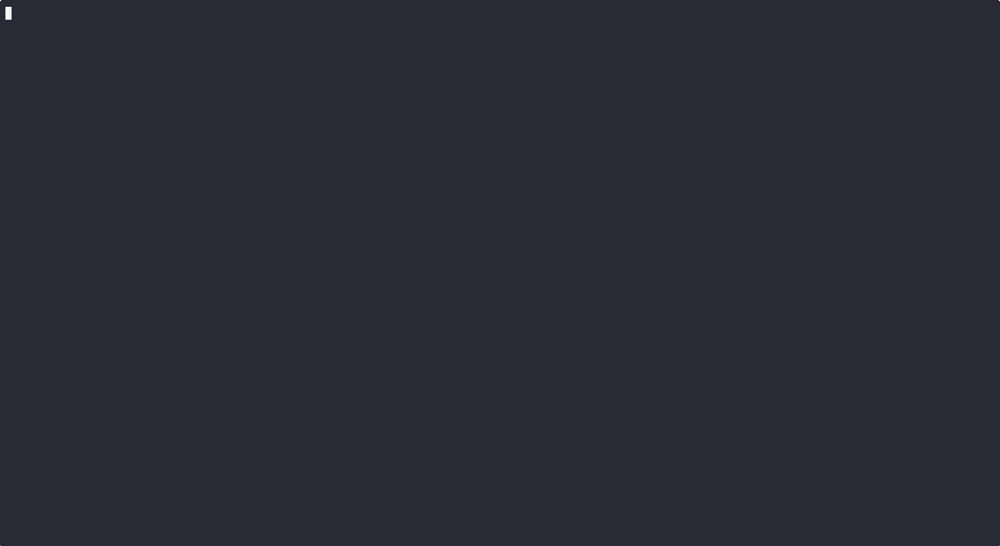

# RTP Stream Monitor

A Go application for monitoring and tracking the availability of Real-time Transport Protocol (RTP) streams in your network. The application discovers and displays stream information by subscribing to the actual stream data.

## Features

- **Terminal User Interface**: Interactive TUI for real-time monitoring
- **Stream Discovery**: Discover streams via mDNS, SAP, or static SDP files
- **Live VU Meters**: Real-time audio level visualization
- **RTCP log**: Detailed per-streamRTCP packet analysis
- **Real-time Updates**: Periodic refresh of stream status and statistics
- **WAV Recording**: Record selected stream to a WAV file
- **PTP Monitor**: If started with sufficient privileges, PTP time transmitters will be monitored and their equivalent RTP timestamp will be displayed in the stream details view.
- **FPGA RX streaming**: Support for Ravenna FPGA stream receiver (only available on Linux with special hardware)

## Demo



## Installation

### Prerequisites

- Go 1.21 or later

### Build from Source

```bash
git clone https://github.com/holoplot/rtp-monitor.git
cd rtp-monitor
go mod download
go build -o rtp-monitor
```

### Build with Make

The project includes a Makefile for easy development:

```bash
make build      # Build the application
make run        # Build and run the application
make clean      # Clean build artifacts
make test       # Run tests
make version    # Show version information
make release    # Build for multiple platforms
```

### Version Information

The application uses `git describe` to automatically determine version information:

- **On a git tag**: `v1.0.0`
- **After a tag**: `v1.0.0-5-gabcdef0` (5 commits after v1.0.0)
- **With changes**: `v1.0.0-5-gabcdef0-dirty`
- **No tags**: `abcdef0` (commit hash only)

```bash
# Check embedded version info
./rtp-monitor version
# Output: v1.0.0-2-gabcdef0 (commit: abcdef0, built: 2025-09-11 14:30:00 UTC, go: go1.24.6)

# Build with custom version (optional)
make build VERSION=v2.0.0-custom

# View build variables
make version
```

## Usage

### Terminal User Interface

Launch the interactive terminal interface:

```bash
./rtp-monitor
```

You can also load SDP files for manual stream configuration:

```bash
./rtp-monitor --sdp stream1.sdp --sdp stream2.sdp
```

### Command Line Options

```bash
Usage:
  rtp-monitor [flags]

Flags:
  -h, --help                    help for rtp-monitor
      --interface stringArray   Network interface to use (can be used multiple times)
      --sdp stringArray         SDP file to parse (can be used multiple times)
  -v, --version                 version for rtp-monitor
      --wav string              Folder to save WAV files
```

## Terminal UI Controls

### Navigation
- `↑` or `k`: Move selection up
- `↓` or `j`: Move selection down
- `Home`: Go to first stream
- `End`: Go to last stream
- `Page Up`: Move up one page
- `Page Down`: Move down one page

### Actions
- `c`: Copy selected stream's SDP to clipboard
- `d`: Show detailed information for selected stream
- `f`: Show FPGA RX modal for selected stream (Linux only)
- `r`: Show RTCP logs for selected stream
- `R`: Record selected stream to a WAV file
- `v`: Show live VU meters for selected audio stream
- `q`, `Ctrl+C`, or `Esc`: Quit application

### Modal Details
- `↑/↓`: Scroll through detailed information
- `Esc`: Close modal and return to main view
`
## Dependencies

- [Cobra](https://github.com/spf13/cobra): CLI framework
- [Bubble Tea](https://github.com/charmbracelet/bubbletea): Terminal UI framework
- [Lipgloss](https://github.com/charmbracelet/lipgloss): Terminal styling

## Contributing

1. Fork the repository
2. Create a feature branch
3. Commit your changes
4. Push to the branch
5. Open a Pull Request

## License

This project is licensed under the MIT License - see the LICENSE file for details.
